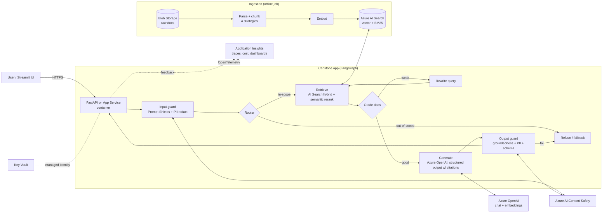

# Capstone Draft: Payments Knowledge Assistant (RAG on Azure)

Status: **draft v0.1 (2026-10-01)**. Nothing is in the repo yet; this is the target shape to build toward from Week 4.

## 1. What it does
Answers questions about banking/payments rules and operations (e.g. "What's the chargeback window for a Visa CNP dispute?", "Which ISO 20022 message replaces MT103?") with cited sources, refuses when the corpus doesn't support an answer, and blocks injection/PII leakage.

**Corpus (public only):** ISO 20022 docs, PCI-DSS summaries, RBI/NPCI/UPI circulars, PSD2/EBA guidance, card-scheme public dispute guides, plus a hand-written FAQ. Stored as PDFs/HTML/Markdown in Blob Storage.

## 2. Architecture



### Request path
1. **Input guard**: Prompt Shields (jailbreak + indirect injection), PII redaction (PAN, IBAN, account no.), length/schema checks.
2. **Router**: classifies in-scope vs out-of-scope vs chit-chat (small model, structured output).
3. **Retrieve**: hybrid search (vector + BM25) with semantic ranker, top-k with metadata filters (source, region, doc date).
4. **Grade**: LLM or reranker score threshold; on weak results rewrite the query once (bounded retry).
5. **Generate**: answer as a Pydantic model `{answer, citations[], confidence}`; prompt template versioned in Git.
6. **Output guard**: groundedness check against retrieved chunks, PII scan, schema validation. Fail means refusal with reason.
7. **Trace**: every node emits an OTel span with latency, tokens, cost, retrieval hit IDs.

### Key decisions (to revisit with numbers)
| Decision | Default | Why / alternative |
|---|---|---|
| Orchestration | LangGraph | Explicit state + retries; SK covered as a side sample |
| Retrieval | AI Search hybrid + semantic ranker | Payments text is acronym-heavy, so BM25 helps; compare vs vector-only in Week 5 |
| Chunking | Structure-aware (headings) | Pick winner from Week 5 eval table |
| Chat model | gpt-4o-mini, gpt-4o for hard cases | Cost/latency; router decides |
| Embeddings | text-embedding-3-small | Cheap; test -large if recall@5 is short |
| API | FastAPI in Docker on App Service | Simplest always-on container; Functions is the alternative |
| UI | Streamlit (or skip, API + demo notebook) | Demo only |
| IaC | Bicep | Native Azure; Terraform fine too |
| Auth to Azure | Managed identity + Key Vault | No keys in env/code |

### Targets for the README (fill with real numbers)
recall@5 ≥ 0.85 · faithfulness ≥ 0.9 · injection block rate ≥ 95% at ≤ 5% false refusals · p95 latency < 4s · cost per query < $0.01

## 3. Repo structure (`pranshu6sept/ai_ml_learning`)

One repo, two tracks: the classical-ML project (Phase 1) and the capstone (Phase 2 onward).

```
ai_ml_learning/
├── README.md                    # portfolio landing page: links, headline metrics
├── pyproject.toml               # uv workspace; ruff, mypy, pytest config
├── .pre-commit-config.yaml
├── .github/workflows/
│   ├── ci.yml                   # lint, typecheck, unit tests (every push)
│   ├── eval.yml                 # golden-set eval gate (PRs touching capstone/prompts)
│   └── deploy.yml               # build image, push to ACR, deploy to App Service (main)
├── notes/                       # weekly write-ups: week-01.md ...
│
├── classical_ml/                # Phase 1: fraud / credit-default
│   ├── notebooks/               # exploration only
│   ├── src/classical_ml/
│   │   ├── data.py              # load + split
│   │   ├── features.py          # ColumnTransformer pipelines
│   │   ├── train.py             # LR baseline, LightGBM, class weights / SMOTE
│   │   ├── evaluate.py          # PR-AUC, ROC-AUC, threshold tuning
│   │   ├── explain.py           # SHAP
│   │   └── drift.py             # PSI / KS (Week 11)
│   ├── tests/
│   └── reports/                 # metrics tables, SHAP plots, "GBM vs LLM" write-up
│
├── capstone/
│   ├── src/payments_rag/
│   │   ├── config.py            # pydantic-settings; reads Key Vault via managed identity
│   │   ├── api/                 # FastAPI app: /ask, /feedback, /health
│   │   ├── graph/
│   │   │   ├── state.py         # LangGraph state model
│   │   │   ├── nodes.py         # route, retrieve, grade, rewrite, generate
│   │   │   └── build.py         # graph wiring + conditional edges
│   │   ├── ingest/
│   │   │   ├── loaders.py       # PDF/HTML/MD parsing
│   │   │   ├── chunkers.py      # fixed, recursive, semantic, structure-aware
│   │   │   └── indexer.py       # AI Search index schema + upload
│   │   ├── retrieval/search.py  # hybrid query + semantic ranker + filters
│   │   ├── guardrails/
│   │   │   ├── input.py         # Prompt Shields, PII redaction
│   │   │   └── output.py        # groundedness, schema, PII
│   │   ├── prompts/             # versioned prompt templates (YAML/Jinja)
│   │   └── telemetry.py         # OpenTelemetry → App Insights; token/cost attrs
│   ├── data/
│   │   ├── raw/                 # gitignored; synced to Blob
│   │   └── manifest.csv         # source list with URLs + licences
│   ├── evals/
│   │   ├── golden_set.jsonl     # 50–100 Q, expected chunk ids, reference answers
│   │   ├── adversarial.jsonl    # OWASP LLM Top 10 cases
│   │   ├── run_retrieval.py     # recall@k, MRR, nDCG
│   │   ├── run_generation.py    # faithfulness, relevance (RAGAS / Foundry)
│   │   ├── run_guardrails.py    # block rate, false-refusal rate
│   │   ├── thresholds.yaml      # CI gate values
│   │   └── results/             # committed result tables per run
│   ├── ui/streamlit_app.py
│   ├── tests/                   # unit tests with mocked Azure clients
│   ├── Dockerfile               # multi-stage
│   └── docs/
│       ├── architecture.md      # this doc, final version + diagram
│       ├── failure-analysis.md
│       └── cost-latency.md
│
└── infra/
    ├── main.bicep               # RG resources: AOAI, AI Search, Content Safety,
    │                            # App Service, ACR, Key Vault, App Insights, Storage
    └── parameters.dev.json
```

## 4. Build order inside the capstone
1. Week 4: `ingest/` + `retrieval/` + a plain retrieve→generate script.
2. Week 5: `evals/` golden set and retrieval/generation runners; pick chunker.
3. Week 6: `graph/` replaces the script; structured outputs.
4. Week 7–8: `infra/`, `config.py` with managed identity, `api/`, deploy.
5. Week 9: Dockerfile, the three workflows, eval gate thresholds.
6. Week 10: `guardrails/` + `adversarial.jsonl` + report.
7. Week 11: `telemetry.py`, dashboards, feedback endpoint, drift.
8. Week 12: docs and demo.

## 5. Cost guardrails
- Set an Azure budget alert before Week 4.
- AI Search: Basic tier is the cheapest with semantic ranker; delete or scale down between sessions if credits are tight.
- Use gpt-4o-mini for development and evals; cache eval responses keyed by prompt version.
